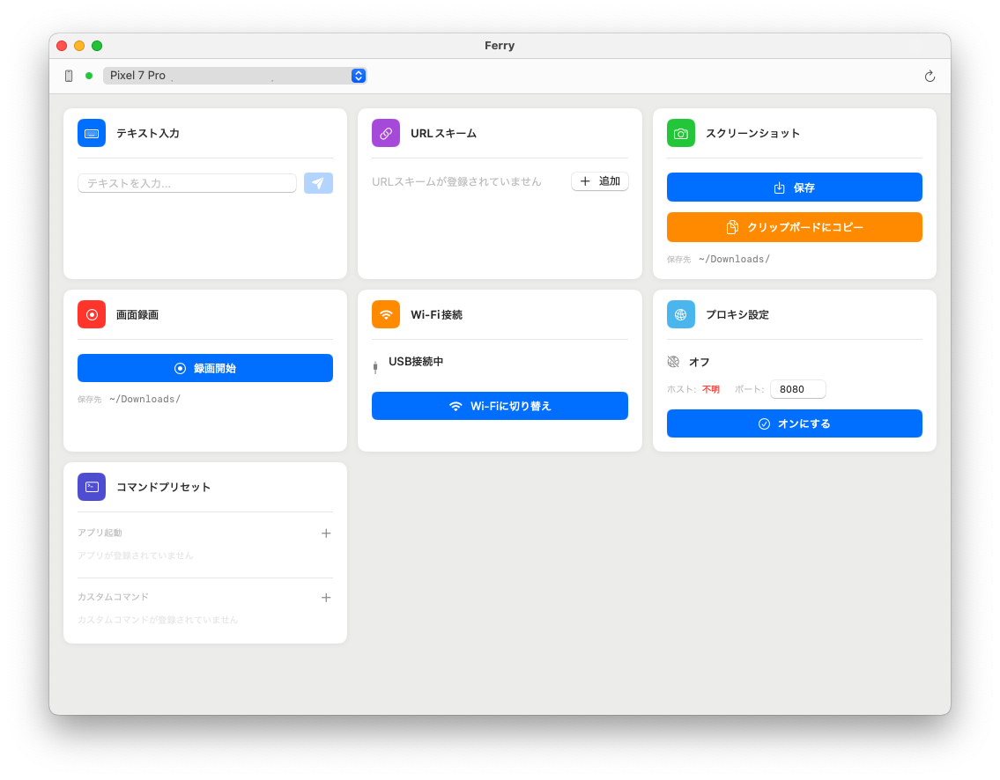

# Ferry

ほとんどの ADB 操作をワンクリックで完結させる、macOS ネイティブアプリケーション。



## 概要

Ferry は Android Debug Bridge (adb) の GUI フロントエンドです。コマンドを覚えたり入力したりする手間を省き、Android 開発中の頻出操作をワンクリックで実行できます。

## 機能

| 機能 | 説明 |
|---|---|
| デバイス管理 | 接続中のデバイスを一覧表示し、操作対象を選択 |
| テキスト入力 | 文字列をデバイスに送信。入力履歴の保存・再送信が可能 |
| URL スキーム | URL スキームをデバイスで起動。プレースホルダー付きテンプレート管理 |
| スクリーンショット | ワンクリックで撮影し `~/Downloads/` に保存 |
| 画面録画 | 開始・停止ボタンで録画し `~/Downloads/` に保存 |
| Wi-Fi 接続 | USB 接続中のデバイスを Wi-Fi adb 接続に切り替え |
| プロキシ設定 | デバイスの HTTP プロキシをワンクリックでオン/オフ（Charles Proxy 向け） |
| コマンドプリセット | よく使うコマンドやアプリ起動をリスト管理してワンクリック実行 |

## 動作要件

- macOS 14 (Sonoma) 以上
- Android SDK インストール済み（環境変数 `ANDROID_HOME` または `ANDROID_SDK_ROOT` が設定されていること）

## ビルド・起動

```bash
# ビルドして即起動
./run.sh

# ビルドのみ
swift build
```

## adb パスの解決

Ferry は以下の優先順で adb バイナリを自動検出します。

1. `$ANDROID_HOME/platform-tools/adb`
2. `$ANDROID_SDK_ROOT/platform-tools/adb`

どちらも設定されていない場合は起動時にエラーが表示されます。

## ライセンス

MIT
